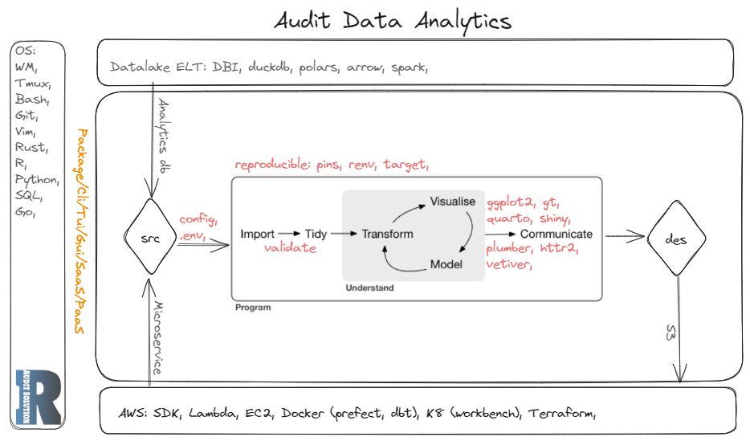

[](https://youtu.be/K4nRmaj-K3I)

Purpose:      
- Improve the financial auditing (accounting) workflow.    
- Add more functions between setup and report if needed. For instance,    

```
polars
duckdb
arrow
fusen
devtools
```

Setup:    
- Ubuntu 22.04.3 LTS on WSL2
- Build the binary from source
- Put it in the PATH
- Export the env variable to the shell


Usage:  

```
faudit help
faudit init
faudit new -c clientname -y 2024 -a "start a new audit project" -i
faudit report -c clientname -y 2024 -a "generate the final report" -i
faudit show tree
faudit show list
```

```
faproj/
├── box
│   ├── config.yml
│   └── stbox
│       └── box.R
├── config.json
└── job
    └── shanghai
        └── 2023
            ├── awp
            │   └── clean.R
            ├── doc
            ├── misc
            ├── pbc
            └── report
                ├── report.html
                ├── report.qmd
                └── report_files
```

